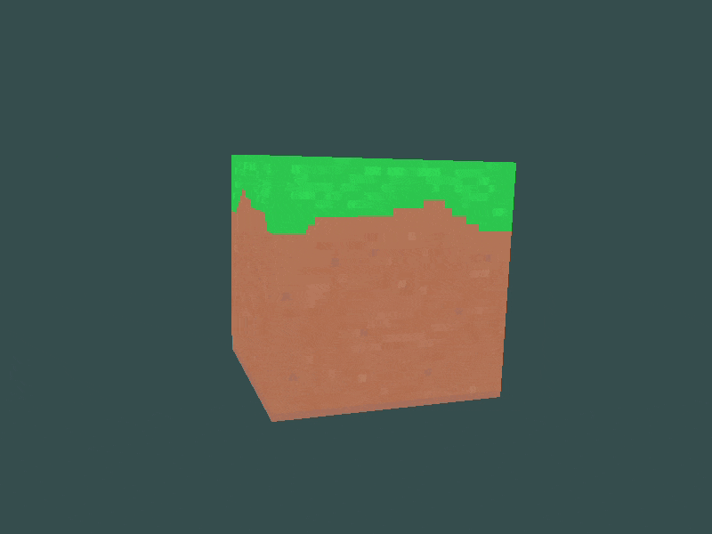

# Minecraft Block Renderer

A lightweight C++ project using OpenGL for rendering a rotating Minecraft dirt block.

<div align="center">  </div>


## Features
- OpenGL-based 3D rendering with GLFW, GLAD, and GLM.
- CMake support for cross-platform compatibility.
- Organized project structure.

## Prerequisites
- C++17-compatible compiler
- CMake (version 3.10 or later)
- OpenGL 3.3 or higher
- GLFW, GLAD, and GLM libraries

## Building the Project

### Windows (Using Visual Studio 17 2022)
1. Make sure to have Visual Studio 2022 or a compatible version installed
2. Open a terminal and navigate to the project directory.
3. Run the following commands:

```
mkdir build 
cd build 
cmake -G "Visual Studio 17 2022" ..
```
4. Open the generated `.sln` file in Visual Studio 2022 and build the solution.
5. In the Solution Explorer menu (on the right tab), right click the `MinecraftBlockRenderer` 
object. In the drop-down menu, pick "Set as Startup Project".
6. Build and run the code (can be done by pressing F5).

### Linux/Mac
1. Open a terminal and navigate to the project directory.
2. Run the following commands:

```
mkdir build
cd build 
cmake .. make
```
3. Run the executable in the `build` folder.

## Resources
The project includes shaders, textures, and helper functions required for the rendering process.
